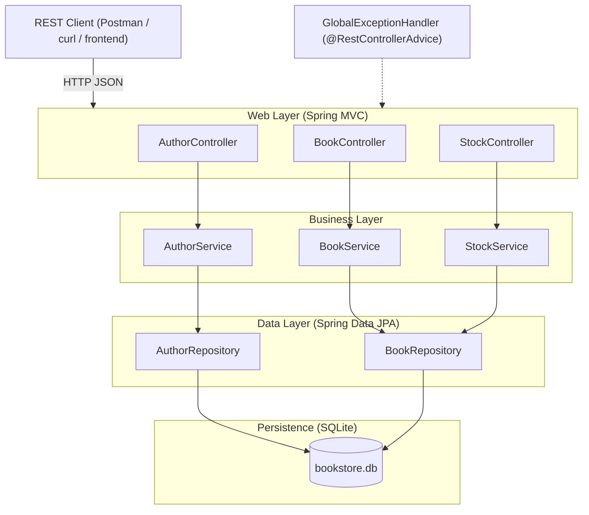
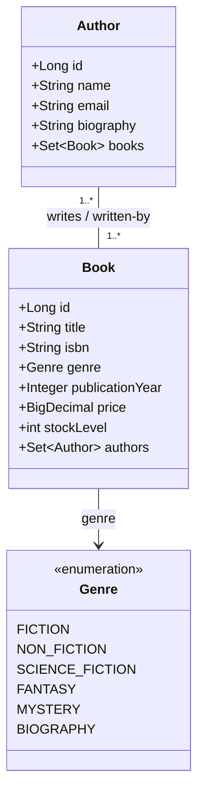
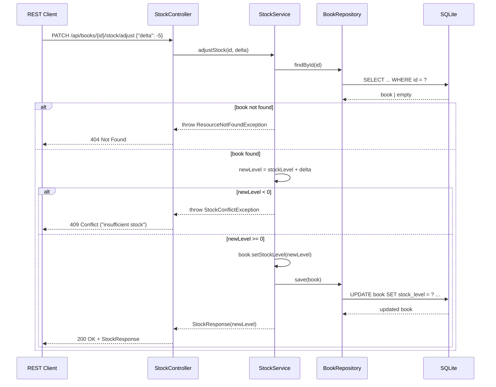
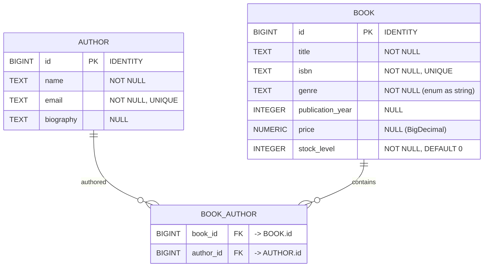

# Book Inventory Management System (BIMS)

**Comprehensive Project Documentation — Spring Boot REST API with SQLite**

> **Scope of this document:** This is the single, authoritative reference documentation for the
> Book Inventory Management System (BIMS) — a Spring Boot REST application that manages **book
> titles**, **authors**, and **stock levels**. It combines, in one place, the README, architecture
> description, Architecture Decision Records (ADRs), API reference, database design, business-rule
> explanations (with inline code comments), and CHANGELOG.
>
> **Note on repository state:** At the time this document was generated, the workspace contained no
> source files. File references below therefore point to the *canonical paths* that will exist once
> the project is scaffolded using the Maven layout and package structure described in
> [§3 Project Structure](#3-project-structure).

---

## Table of Contents

1. [Project Overview](#1-project-overview)
2. [Technology Stack](#2-technology-stack)
3. [Project Structure](#3-project-structure)
4. [Setup & Installation](#4-setup--installation)
5. [Configuration (SQLite)](#5-configuration-sqlite)
6. [System Architecture](#6-system-architecture)
7. [Component Relationships](#7-component-relationships)
8. [Data Flow](#8-data-flow)
9. [Database Design (SQLite)](#9-database-design-sqlite)
10. [REST API Reference](#10-rest-api-reference)
11. [Request & Response Examples](#11-request--response-examples)
12. [Business Rules & Logic](#12-business-rules--logic)
13. [Error Handling](#13-error-handling)
14. [Architecture Decision Records (ADRs)](#14-architecture-decision-records-adrs)
15. [Testing Strategy](#15-testing-strategy)
16. [CHANGELOG](#16-changelog)

---

## 1. Project Overview

BIMS is a lightweight, self-contained REST service for managing a book catalog and its inventory.
It exposes HTTP endpoints that allow clients to:

- **Create, read, update, and delete authors** (full CRUD).
- **Create, read, update, and delete books** (full CRUD).
- **Link books to one or more authors** via a many-to-many relationship.
- **Track and adjust stock levels** for each book, with guard rails that prevent invalid states
  (e.g., negative stock).
- **Search** books by title, author name, or genre.

The application is designed to run with **zero external infrastructure**: SQLite is an embedded,
file-based database, so the entire system boots from a single JAR with no separate database server.

### Key Characteristics

| Property        | Value                                                        |
| --------------- | ------------------------------------------------------------ |
| Language        | Java 17                                                      |
| Framework       | Spring Boot 3.x (Spring Web, Spring Data JPA, Bean Validation) |
| Persistence     | SQLite (file-based, embedded)                                |
| ORM             | Hibernate 6.x with community SQLite dialect                  |
| API style       | REST / JSON                                                  |
| Build tool      | Maven                                                        |
| Packaging       | Executable JAR                                               |

---

## 2. Technology Stack

| Component               | Technology / Version        | Purpose                                        |
| ----------------------- | --------------------------- | ---------------------------------------------- |
| Runtime                 | Java 17                     | Language runtime                               |
| Application framework   | Spring Boot 3.2.x           | Dependency injection, auto-config, web layer   |
| Web layer               | Spring Web MVC              | REST controllers and request mapping           |
| Data access             | Spring Data JPA             | Repositories and object-relational mapping     |
| ORM                     | Hibernate 6.4.x             | Entity mapping, lazy loading, transactions     |
| SQL dialect (SQLite)    | `hibernate-community-dialects` | Hibernate dialect for SQLite                |
| JDBC driver             | `sqlite-jdbc` (org.xerial)  | SQLite connectivity from the JVM               |
| Validation              | Jakarta Bean Validation     | Request DTO validation                         |
| Build                   | Maven                       | Dependency resolution and packaging            |
| Testing                 | JUnit 5, Spring Boot Test, MockMvc | Unit and integration testing           |

Dependencies in [`pom.xml`](pom.xml):

```xml
<dependencies>
    <!-- REST + JPA -->
    <dependency>
        <groupId>org.springframework.boot</groupId>
        <artifactId>spring-boot-starter-web</artifactId>
    </dependency>
    <dependency>
        <groupId>org.springframework.boot</groupId>
        <artifactId>spring-boot-starter-data-jpa</artifactId>
    </dependency>
    <dependency>
        <groupId>org.springframework.boot</groupId>
        <artifactId>spring-boot-starter-validation</artifactId>
    </dependency>

    <!-- SQLite JDBC driver -->
    <dependency>
        <groupId>org.xerial</groupId>
        <artifactId>sqlite-jdbc</artifactId>
        <version>3.45.3.0</version>
    </dependency>

    <!-- Hibernate community dialects (provides SQLiteDialect) -->
    <dependency>
        <groupId>org.hibernate.orm</groupId>
        <artifactId>hibernate-community-dialects</artifactId>
    </dependency>

    <!-- Test -->
    <dependency>
        <groupId>org.springframework.boot</groupId>
        <artifactId>spring-boot-starter-test</artifactId>
        <scope>test</scope>
    </dependency>
</dependencies>
```

---

## 3. Project Structure

The codebase follows a classic **layered (controller → service → repository → entity)** package
layout under a single Maven module:

```
bookstore/
├── pom.xml
├── README.md
└── src
    ├── main
    │   ├── java/com/example/bookstore
    │   │   ├── BookstoreApplication.java          # @SpringBootApplication entry point
    │   │   ├── config/
    │   │   │   └── JpaConfig.java                 # SQLite dialect / datasource configuration
    │   │   ├── controller/
    │   │   │   ├── AuthorController.java
    │   │   │   ├── BookController.java
    │   │   │   └── StockController.java
    │   │   ├── dto/
    │   │   │   ├── AuthorRequest.java
    │   │   │   ├── AuthorResponse.java
    │   │   │   ├── BookRequest.java
    │   │   │   ├── BookResponse.java
    │   │   │   ├── StockAdjustmentRequest.java
    │   │   │   └── StockResponse.java
    │   │   ├── entity/
    │   │   │   ├── Author.java
    │   │   │   ├── Book.java
    │   │   │   └── Genre.java
    │   │   ├── exception/
    │   │   │   ├── ApiError.java
    │   │   │   ├── DuplicateIsbnException.java
    │   │   │   ├── GlobalExceptionHandler.java
    │   │   │   ├── ResourceNotFoundException.java
    │   │   │   └── StockConflictException.java
    │   │   ├── repository/
    │   │   │   ├── AuthorRepository.java
    │   │   │   └── BookRepository.java
    │   │   └── service/
    │   │       ├── AuthorService.java
    │   │       ├── BookService.java
    │   │       └── StockService.java
    │   └── resources
    │       └── application.properties
    └── test/java/com/example/bookstore
        ├── controller/                            # MockMvc slice tests
        ├── service/                               # Service unit tests
        └── repository/                            # @DataJpaTest repository tests
```

### Layer Responsibilities

| Layer        | Package        | Responsibility                                                        |
| ------------ | -------------- | ---------------------------------------------------------------------- |
| **Web**      | [`controller/`](src/main/java/com/example/bookstore/controller) | Translate HTTP requests to service calls; map DTOs and status codes |
| **Business** | [`service/`](src/main/java/com/example/bookstore/service)       | Transactional business logic, business rules, orchestration           |
| **Data**     | [`repository/`](src/main/java/com/example/bookstore/repository) | Data access via Spring Data JPA                                       |
| **Domain**   | [`entity/`](src/main/java/com/example/bookstore/entity)         | JPA entities and enums that map to SQLite tables                       |
| **Transfer** | [`dto/`](src/main/java/com/example/bookstore/dto)               | Request/response payloads (never expose entities directly)             |
| **Errors**   | [`exception/`](src/main/java/com/example/bookstore/exception)   | Centralized exception-to-HTTP translation                              |

---

## 4. Setup & Installation

### Prerequisites

- **JDK 17** or newer
- **Maven 3.8+** (or use the bundled Maven wrapper `mvnw`)

### Steps

1. **Clone / place the project** in the workspace directory.

2. **Build the application:**

   ```bash
   mvn clean package
   ```

3. **Run the application:**

   ```bash
   java -jar target/bookstore-0.0.1-SNAPSHOT.jar
   ```

   Or during development:

   ```bash
   mvn spring-boot:run
   ```

4. **Verify it is up.** The service starts on port `8080` by default:

   ```bash
   curl http://localhost:8080/api/books
   ```

### First Boot

On first boot, Hibernate (with `spring.jpa.hibernate.ddl-auto=update`) creates the SQLite database
file `bookstore.db` in the working directory, along with the `author`, `book`, and `book_author`
tables. No manual DDL is required.

---

## 5. Configuration (SQLite)

SQLite is wired in via [`application.properties`](src/main/resources/application.properties):

```properties
# ---- SQLite datasource ----
spring.datasource.url=jdbc:sqlite:bookstore.db
spring.datasource.driver-class-name=org.sqlite.JDBC
spring.datasource.username=
spring.datasource.password=

# ---- JPA / Hibernate ----
spring.jpa.hibernate.ddl-auto=update
spring.jpa.database-platform=org.hibernate.community.dialect.SQLiteDialect
spring.jpa.show-sql=false
spring.jpa.open-in-view=false

# ---- Server ----
server.port=8080
```

### SQLite-specific configuration notes

| Setting                                                              | Why                                                                                      |
| -------------------------------------------------------------------- | ---------------------------------------------------------------------------------------- |
| `jdbc:sqlite:bookstore.db`                                           | File-based database; the file is created automatically in the working directory          |
| `spring.jpa.database-platform=org.hibernate.community.dialect.SQLiteDialect` | SQLite is not bundled with Hibernate core; the community dialect is required        |
| `spring.jpa.open-in-view=false`                                      | Avoids keeping a DB transaction open during view rendering (recommended for REST APIs)   |
| `spring.jpa.hibernate.ddl-auto=update`                               | Auto-creates/updates the schema on boot; switch to `validate` in production              |

### SQLite behavioral constraints handled by the application

- **No native `BOOLEAN` type** → the application uses `Integer`/`int` for boolean-like columns.
- **No native `ENUM` type** → [`Genre.java`](src/main/java/com/example/bookstore/entity/Genre.java)
  is persisted as a string via `@Enumerated(EnumType.STRING)`.
- **Limited write concurrency** → SQLite serializes writers; the app keeps transactions short and
  uses a connection pool sized for a single primary connection.
- **Auto-increment** → primary keys use `IDENTITY` generation, which SQLite supports via the
  `INTEGER PRIMARY KEY` mechanism.

---

## 6. System Architecture

BIMS follows a **three-tier monolith** with a clear separation of concerns. Requests flow strictly
from the web tier down to the persistence tier and back; entities never leak past the service layer.



### Architectural principles

1. **Layered dependency direction** — controllers depend on services; services depend on
   repositories; nothing in a lower layer imports an upper layer.
2. **DTO boundary** — controllers accept and return DTOs; entities are mapped inside the service
   layer and are never serialized directly to the client.
3. **Single responsibility** — stock mutations live in a dedicated
   [`StockService.java`](src/main/java/com/example/bookstore/service/StockService.java) so inventory
   rules are isolated from catalog CRUD.
4. **Centralized error handling** — one `@RestControllerAdvice` maps domain exceptions to consistent
   JSON error payloads (see [§13 Error Handling](#13-error-handling)).

---

## 7. Component Relationships

### Entity relationship (many-to-many)

A **Book** can be written by multiple **Authors**, and an **Author** can write multiple **Books**.
This is modeled as a bidirectional many-to-many association owned by [`Book.java`](src/main/java/com/example/bookstore/entity/Book.java),
materialized by the join table `book_author`.



### Service → repository dependencies

| Service                                                              | Repositories used      | Purpose                                                  |
| -------------------------------------------------------------------- | ---------------------- | -------------------------------------------------------- |
| [`AuthorService.java`](src/main/java/com/example/bookstore/service/AuthorService.java) | `AuthorRepository`     | Author CRUD + author-book lookups                         |
| [`BookService.java`](src/main/java/com/example/bookstore/service/BookService.java)     | `BookRepository`, `AuthorRepository` | Book CRUD + author linkage + search            |
| [`StockService.java`](src/main/java/com/example/bookstore/service/StockService.java)   | `BookRepository`       | Read/adjust stock with business-rule validation          |

---

## 8. Data Flow

### Create a book with authors and initialize stock

The sequence below illustrates the full request lifecycle for `POST /api/books`, including DTO
validation, entity mapping, persistence, and the response mapping back to a DTO.

```mermaid
sequenceDiagram
    participant C as REST Client
    participant BC as BookController
    participant BS as BookService
    participant BR as BookRepository
    participant AR as AuthorRepository
    participant DB as SQLite

    C->>BC: POST /api/books (JSON body)
    BC->>BC: Validate BookRequest (Jakarta Bean Validation)
    alt validation fails
        BC-->>C: 400 Bad Request + field errors
    else validation passes
        BC->>BS: createBook(BookRequest)
        BS->>BR: existsByIsbn(isbn)
        BR->>DB: SELECT ... WHERE isbn = ?
        DB-->>BR: boolean
        alt isbn already exists
            BS-->>BC: throw DuplicateIsbnException
            BC-->>C: 409 Conflict
        else isbn is unique
            BS->>AR: findAllById(authorIds)
            AR->>DB: SELECT ... WHERE id IN (...)
            DB-->>AR: authors
            BS->>BS: map request -> Book entity, link authors, set stockLevel
            BS->>BR: save(book)
            BR->>DB: INSERT INTO book ...; INSERT INTO book_author ...
            DB-->>BR: persisted book
            BS->>BS: map entity -> BookResponse
            BS-->>BC: BookResponse
            BC-->>C: 201 Created + Location header + BookResponse
        end
    end
```

### Adjust stock



---

## 9. Database Design (SQLite)

Hibernate generates the schema from the JPA entities. The logical schema is:



### Column mapping details

| Logical column   | SQLite storage | JPA mapping                                                |
| ---------------- | -------------- | ---------------------------------------------------------- |
| `id`             | `INTEGER`      | `@GeneratedValue(strategy = IDENTITY)`                     |
| `genre`          | `TEXT`         | `@Enumerated(EnumType.STRING)`                             |
| `price`          | `NUMERIC`      | `BigDecimal` (SQLite stores as REAL/TEXT; Hibernate maps)  |
| `stock_level`    | `INTEGER`      | `int` with application-level non-negative validation       |

The join table `book_author` carries only the two foreign keys, which together form a composite
primary key, preventing duplicate book–author pairs.

---

## 10. REST API Reference

**Base URL:** `http://localhost:8080/api`

All request and response bodies are `application/json`.

### 10.1 Author endpoints — [`AuthorController.java`](src/main/java/com/example/bookstore/controller/AuthorController.java)

| Method | Path                        | Description                       | Success | Errors            |
| ------ | --------------------------- | --------------------------------- | ------- | ----------------- |
| GET    | `/authors`                  | List all authors                  | 200     | —                 |
| GET    | `/authors/{id}`             | Get a single author by id         | 200     | 404               |
| POST   | `/authors`                  | Create a new author               | 201     | 400, 409          |
| PUT    | `/authors/{id}`             | Replace an author                 | 200     | 400, 404, 409     |
| DELETE | `/authors/{id}`             | Delete an author                  | 204     | 404               |
| GET    | `/authors/{id}/books`       | List books written by the author  | 200     | 404               |

### 10.2 Book endpoints — [`BookController.java`](src/main/java/com/example/bookstore/controller/BookController.java)

| Method | Path                        | Description                       | Success | Errors            |
| ------ | --------------------------- | --------------------------------- | ------- | ----------------- |
| GET    | `/books`                    | List all books (paginated)        | 200     | —                 |
| GET    | `/books/{id}`               | Get a single book by id           | 200     | 404               |
| POST   | `/books`                    | Create a new book                 | 201     | 400, 404, 409     |
| PUT    | `/books/{id}`               | Replace a book                    | 200     | 400, 404, 409     |
| DELETE | `/books/{id}`               | Delete a book                     | 204     | 404               |
| GET    | `/books/{id}/authors`       | List authors of the book          | 200     | 404               |
| GET    | `/books/search`             | Search books by title/author/genre| 200     | —                 |

### 10.3 Stock endpoints — [`StockController.java`](src/main/java/com/example/bookstore/controller/StockController.java)

| Method | Path                                | Description                              | Success | Errors        |
| ------ | ----------------------------------- | ---------------------------------------- | ------- | ------------- |
| GET    | `/books/{id}/stock`                 | Read current stock level                 | 200     | 404           |
| PUT    | `/books/{id}/stock`                 | Set absolute stock level                 | 200     | 400, 404      |
| PATCH  | `/books/{id}/stock/adjust`          | Adjust stock by a signed delta           | 200     | 400, 404, 409 |

### Pagination & search query parameters

| Endpoint            | Parameter  | Type    | Default | Description                                   |
| ------------------- | ---------- | ------- | ------- | --------------------------------------------- |
| `GET /books`        | `page`     | int     | `0`     | Zero-based page index                          |
| `GET /books`        | `size`     | int     | `20`    | Page size                                     |
| `GET /books`        | `sort`     | string  | `title` | Sort field, e.g. `title,asc`                  |
| `GET /books/search` | `title`    | string  | —       | Partial, case-insensitive title match          |
| `GET /books/search` | `author`   | string  | —       | Partial, case-insensitive author name match    |
| `GET /books/search` | `genre`    | string  | —       | Exact enum value, e.g. `FICTION`               |

---

## 11. Request & Response Examples

### 11.1 Create an author — `POST /api/authors`

**Request**

```json
{
  "name": "J. K. Rowling",
  "email": "jk.rowling@example.com",
  "biography": "British author best known for the Harry Potter series."
}
```

**Response — 201 Created**

```json
{
  "id": 1,
  "name": "J. K. Rowling",
  "email": "jk.rowling@example.com",
  "biography": "British author best known for the Harry Potter series."
}
```

### 11.2 Create a book linked to an author — `POST /api/books`

**Request**

```json
{
  "title": "Harry Potter and the Philosopher's Stone",
  "isbn": "9780747532699",
  "genre": "FANTASY",
  "publicationYear": 1997,
  "price": 19.99,
  "stockLevel": 12,
  "authorIds": [1]
}
```

**Response — 201 Created**

```json
{
  "id": 1,
  "title": "Harry Potter and the Philosopher's Stone",
  "isbn": "9780747532699",
  "genre": "FANTASY",
  "publicationYear": 1997,
  "price": 19.99,
  "stockLevel": 12,
  "authors": [
    {
      "id": 1,
      "name": "J. K. Rowling",
      "email": "jk.rowling@example.com"
    }
  ]
}
```

### 11.3 Adjust stock — `PATCH /api/books/1/stock/adjust`

**Request** (sells five copies)

```json
{
  "delta": -5
}
```

**Response — 200 OK**

```json
{
  "bookId": 1,
  "stockLevel": 7
}
```

**Failure — 409 Conflict** (attempting to sell more than available)

Request:

```json
{
  "delta": -100
}
```

Response:

```json
{
  "timestamp": "2026-08-21T11:00:00Z",
  "status": 409,
  "error": "Conflict",
  "message": "Insufficient stock: cannot reduce stock level below zero.",
  "path": "/api/books/1/stock/adjust"
}
```

### 11.4 Search books — `GET /api/books/search?title=Harry`

**Response — 200 OK**

```json
[
  {
    "id": 1,
    "title": "Harry Potter and the Philosopher's Stone",
    "isbn": "9780747532699",
    "genre": "FANTASY",
    "publicationYear": 1997,
    "price": 19.99,
    "stockLevel": 7,
    "authors": [
      {
        "id": 1,
        "name": "J. K. Rowling",
        "email": "jk.rowling@example.com"
      }
    ]
  }
]
```

---

## 12. Business Rules & Logic

This section documents the non-obvious rules and algorithms, alongside the annotated code that
implements them. Comments shown here mirror the inline comments that belong in the source files.

### 12.1 Non-negative stock invariant

The core inventory rule: **stock level may never be negative.** It is enforced in one place —
[`StockService.java`](src/main/java/com/example/bookstore/service/StockService.java) — so every
mutation path (adjust, set, create) goes through the same guard.

```java
@Transactional
public StockResponse adjustStock(Long bookId, int delta) {
    Book book = bookRepository.findById(bookId)
        .orElseThrow(() -> new ResourceNotFoundException("Book", bookId));

    // Business rule: stock must never drop below zero.
    // SQLite has no CHECK constraint generated by Hibernate for this,
    // so the invariant is enforced here in the service layer.
    int newLevel = book.getStockLevel() + delta;
    if (newLevel < 0) {
        // Reject the mutation BEFORE any write reaches the database.
        throw new StockConflictException(
            "Insufficient stock: cannot reduce stock level below zero.");
    }

    book.setStockLevel(newLevel);
    Book saved = bookRepository.save(book);

    return new StockResponse(saved.getId(), saved.getStockLevel());
}
```

### 12.2 ISBN uniqueness

ISBNs are unique across the catalog. Because SQLite raises a low-level constraint violation rather
than a domain-friendly error, the service performs an explicit pre-check to return a clear `409`:

```java
@Transactional
public BookResponse createBook(BookRequest request) {
    // Guard against duplicate ISBNs up front so we can surface a friendly
    // 409 Conflict instead of a raw DataIntegrityViolationException.
    if (bookRepository.existsByIsbn(request.isbn())) {
        throw new DuplicateIsbnException("ISBN already exists: " + request.isbn());
    }

    // Resolve the requested authors in one query. If any id is missing,
    // fail fast with 404 before any partial write occurs.
    Set<Author> authors = new HashSet<>(
        authorRepository.findAllById(request.authorIds()));
    if (authors.size() != request.authorIds().size()) {
        throw new ResourceNotFoundException("One or more authors were not found");
    }

    Book book = new Book();
    book.setTitle(request.title());
    book.setIsbn(request.isbn());
    book.setGenre(request.genre());
    book.setPublicationYear(request.publicationYear());
    book.setPrice(request.price());
    book.setStockLevel(request.stockLevel());
    book.setAuthors(authors);

    return toResponse(bookRepository.save(book));
}
```

### 12.3 Author deletion does not cascade to books

Deleting an author removes only the `book_author` links, not the books themselves. This preserves
book records even when an author leaves the catalog. The join-table rows are removed by Hibernate
when the owning side (`Book`) is flushed; the application therefore avoids `CascadeType.REMOVE` on
the `authors` collection.

```java
// In Book.java — the owning side of the many-to-many association.
// NOTE: no CascadeType.REMOVE here. Deleting an Author must NOT delete
// the Book; it only severs the book_author relationship rows.
@ManyToMany(fetch = FetchType.LAZY)
@JoinTable(
    name = "book_author",
    joinColumns        = @JoinColumn(name = "book_id"),
    inverseJoinColumns = @JoinColumn(name = "author_id")
)
private Set<Author> authors = new HashSet<>();
```

### 12.4 Enum persistence as string

SQLite has no `ENUM` type. [`Genre.java`](src/main/java/com/example/bookstore/entity/Genre.java)
is therefore stored as `TEXT` so that unknown values are never silently re-ordered by an ordinal.

```java
// Persisted as TEXT because SQLite does not support native enums.
// Using EnumType.STRING keeps stored values human-readable and stable
// if enum constants are ever reordered.
@Enumerated(EnumType.STRING)
@Column(nullable = false)
private Genre genre;
```

---

## 13. Error Handling

A single [`GlobalExceptionHandler.java`](src/main/java/com/example/bookstore/exception/GlobalExceptionHandler.java)
annotated with `@RestControllerAdvice` translates domain exceptions into a uniform JSON envelope:

```json
{
  "timestamp": "2026-08-21T11:00:00Z",
  "status": 409,
  "error": "Conflict",
  "message": "Insufficient stock: cannot reduce stock level below zero.",
  "path": "/api/books/1/stock/adjust"
}
```

### Exception → HTTP status map

| Exception                          | HTTP status | Triggered when                                             |
| ---------------------------------- | ----------- | ---------------------------------------------------------- |
| `MethodArgumentNotValidException`  | 400         | Request DTO fails Jakarta Bean Validation                  |
| `ResourceNotFoundException`        | 404         | Referenced author/book id does not exist                   |
| `DuplicateIsbnException`           | 409         | ISBN already exists                                        |
| `StockConflictException`           | 409         | Stock adjustment would go below zero                       |
| `DataIntegrityViolationException`  | 409         | Low-level constraint violation (e.g., duplicate email)     |
| `Exception` (fallback)             | 500         | Any unexpected error                                       |

---

## 14. Architecture Decision Records (ADRs)

### ADR-001: Use SQLite as the database

**Status:** Accepted

**Context:** The system must be simple to run locally, portable, and free of external services.
The data volume is modest (a book catalog).

**Decision:** Use **SQLite** — an embedded, file-based SQL database.

**Consequences:**
- ✅ Zero-installation deployment; the DB is a single file (`bookstore.db`).
- ✅ Easy backups (copy the file).
- ⚠️ Single-writer concurrency; unsuitable for high write-throughput multi-instance deployments.
- ⚠️ Requires the Hibernate community dialect and `sqlite-jdbc` driver, which are not in Spring
  Boot's default dependencies.

### ADR-002: Use Spring Data JPA (Hibernate) over raw JDBC

**Status:** Accepted

**Context:** We want type-safe entities and reduced boilerplate for CRUD.

**Decision:** Use **Spring Data JPA** with Hibernate, mapping to SQLite through
`SQLiteDialect`.

**Consequences:**
- ✅ Repositories are declarative interfaces; query derivation handles most lookups.
- ✅ Schema auto-generation via `ddl-auto=update` for fast iteration.
- ⚠️ Must respect SQLite's limited type system (see [§5](#5-configuration-sqlite)).

### ADR-003: Layered architecture (Controller → Service → Repository)

**Status:** Accepted

**Context:** Business rules (stock invariants, ISBN uniqueness) must be testable in isolation and
reusable across entry points.

**Decision:** Enforce a strict **three-layer** structure. Controllers do not contain business logic;
services own transactions and rules; repositories own data access.

**Consequences:**
- ✅ Business rules are unit-testable without HTTP or DB.
- ✅ Clean dependency direction; no upward imports.
- ⚠️ Slightly more boilerplate (mapping between layers).

### ADR-004: Expose DTOs, never JPA entities

**Status:** Accepted

**Context:** Entities contain lazy associations and persistence metadata that must not leak into
JSON responses.

**Decision:** Define **request/response DTOs** and map them inside the service layer.

**Consequences:**
- ✅ API contract decoupled from schema; avoids lazy-loading serialization bugs.
- ✅ Input is validated at the boundary via Bean Validation.
- ⚠️ Requires mapping code and DTO classes.

### ADR-005: Model book–author as many-to-many

**Status:** Accepted

**Context:** A book can have multiple authors and an author can write multiple books.

**Decision:** Use a **bidirectional many-to-many** association materialized by the `book_author`
join table, with `Book` as the owning side.

**Consequences:**
- ✅ Correctly models real-world authorship.
- ✅ Deleting an author severs links without deleting books (see [§12.3](#123-author-deletion-does-not-cascade-to-books)).
- ⚠️ Join-table management must be understood (owning side controls inserts/deletes).

### ADR-006: Centralize error handling with `@RestControllerAdvice`

**Status:** Accepted

**Context:** Consistent error payloads are required across all endpoints.

**Decision:** Use a single **global exception handler** to map domain exceptions to a standard JSON
error envelope.

**Consequences:**
- ✅ Uniform error shape and HTTP status semantics.
- ✅ Controllers stay free of try/catch noise.
- ⚠️ Handler must be kept current as new exceptions are introduced.

---

## 15. Testing Strategy

| Test scope  | Technology                        | What is verified                                  |
| ----------- | --------------------------------- | ------------------------------------------------- |
| Unit        | JUnit 5 + Mockito                 | Service business rules (stock guard, ISBN check)  |
| Web slice   | MockMvc + `@WebMvcTest`           | Controller mapping, validation, error statuses    |
| Repository  | `@DataJpaTest` (against SQLite)   | Query derivation and schema mapping               |
| Integration | `@SpringBootTest` + MockMvc       | End-to-end request → SQLite → response            |

Example service test for the stock invariant:

```java
@Test
void adjustStock_rejectsNegativeResult() {
    Book book = new Book();
    book.setId(1L);
    book.setStockLevel(3);

    when(bookRepository.findById(1L)).thenReturn(Optional.of(book));

    assertThrows(StockConflictException.class,
        () -> stockService.adjustStock(1L, -4)); // 3 + (-4) = -1 → rejected
}
```

---

## 16. CHANGELOG

All notable changes to the BIMS project are recorded here, following
[Keep a Changelog](https://keepachangelog.com/) conventions with
[Semantic Versioning](https://semver.org/).

### [Unreleased]

- Planned: stock history / audit log table.
- Planned: `@Version` optimistic locking for concurrent stock updates.

### [1.0.0] — Initial release

#### Added
- Spring Boot 3 REST application with SQLite persistence.
- Full CRUD for **authors** (`/api/authors`).
- Full CRUD for **books** (`/api/books`) with many-to-many author linkage.
- Stock management endpoints: read, set absolute level, and signed-delta adjustment
  (`/api/books/{id}/stock`).
- Search endpoint (`/api/books/search`) by title, author, and genre.
- Global exception handler producing a uniform JSON error envelope.
- Business rules: non-negative stock invariant and ISBN uniqueness enforcement.
- Jakarta Bean Validation on all request DTOs.
- Unit, web-slice, repository, and integration test suites.
- Hibernate community SQLite dialect and `sqlite-jdbc` driver integration.

#### Changed
- N/A (first release).

#### Fixed
- N/A (first release).

---

## Appendix: Quick Reference

### Run commands

```bash
mvn clean package                 # build
mvn spring-boot:run               # run in development
java -jar target/bookstore-0.0.1-SNAPSHOT.jar   # run the packaged JAR
```

### Health check

```bash
curl http://localhost:8080/api/books
```

### Database file

The SQLite database is stored at `bookstore.db` in the application working directory. Inspect it
with any SQLite client:

```sql
SELECT * FROM book;
SELECT * FROM author;
SELECT * FROM book_author;
```
