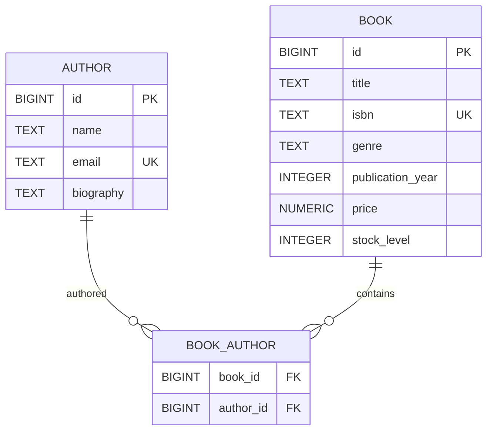

# Data model overview

> **Sources** — interview Q6; README.md §9; `../sources/decisions/2026-08-21-001-sqlite-database.md`; issue #4; [stock-history.md](stock-history.md)
> **Status** — [spec]
> **Page-size budget** — used 50 / 150 lines

<a id="purpose"></a>
## Purpose

SQLite schema generated by Hibernate from JPA entities. Three tables: `author`, `book`, and the join table `book_author`.

<a id="tables"></a>
## Tables

| Table | Purpose | Page |
|---|---|---|
| `author` | People credited with writing books | [author.md](author.md) |
| `book` | Catalog titles plus stock levels | [book.md](book.md) |
| `book_author` | Many-to-many join between book and author | [book-author.md](book-author.md) |
| `stock_history` | Append-only audit trail of stock changes | [stock-history.md](stock-history.md) |

<a id="er-diagram"></a>
## ER diagram



<a id="sqlite-mapping"></a>
## SQLite mapping rules

- No native BOOLEAN → store `INTEGER`.
- No native ENUM → `@Enumerated(EnumType.STRING)` stores TEXT (see [book.md#columns](book.md#columns)).
- `BIGINT` primary key with `IDENTITY` generation (SQLite `INTEGER PRIMARY KEY`).
- `NUMERIC` for `BigDecimal` price.

<a id="verify"></a>
## Verify

```bash
sqlite3 bookstore.db ".tables"
```
Expected: `author  book  book_author`.
